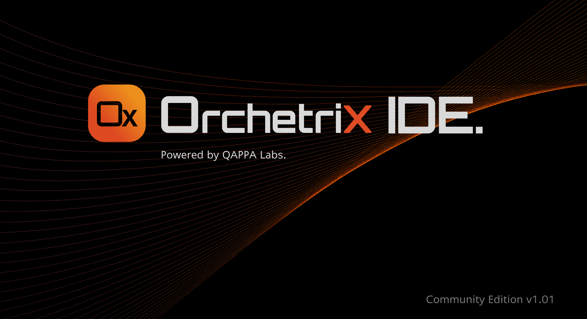
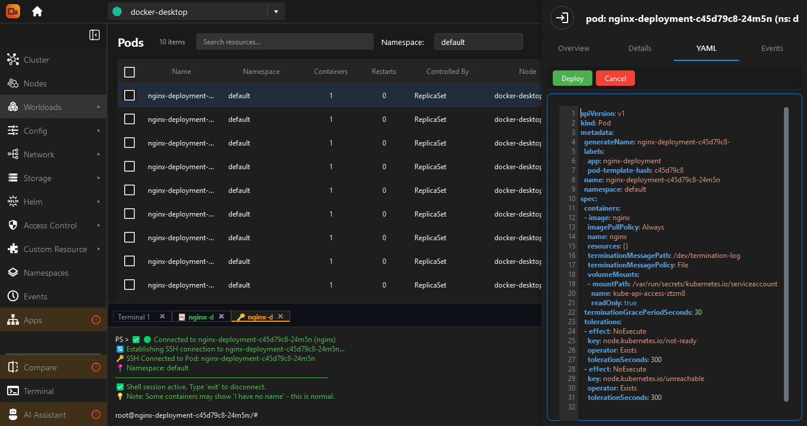
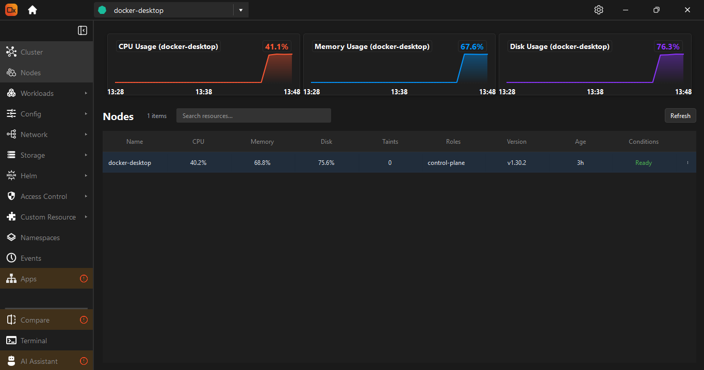
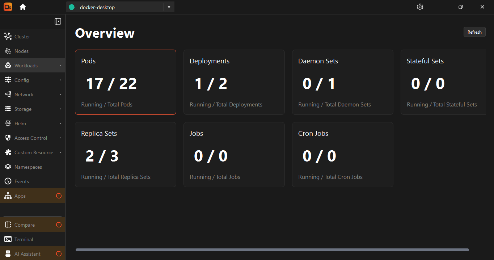
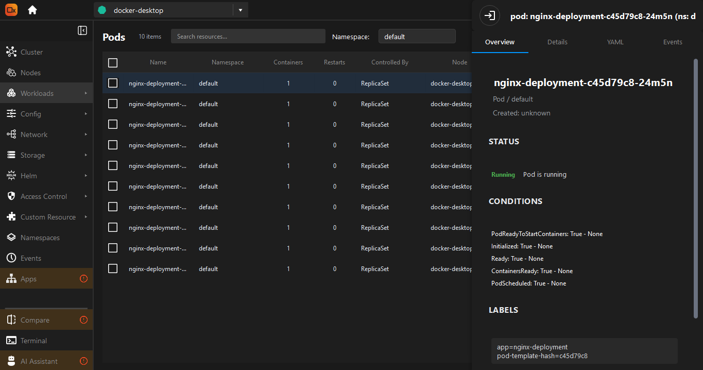
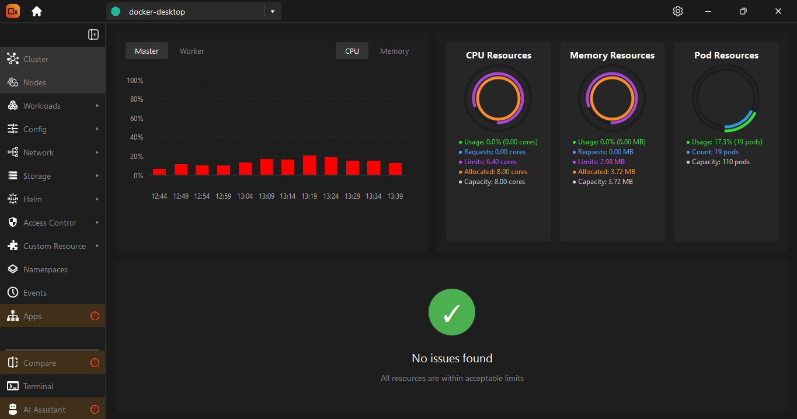
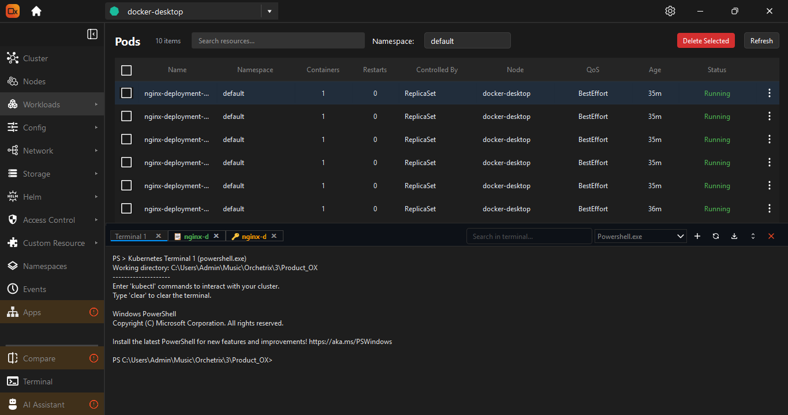

##
# Orchetrix (OX) 🚀 — Intelligent Kubernetes IDE

**Orchetrix (OX)** is a powerful, intuitive, and intelligent Kubernetes cluster management IDE built for developers, SREs, and DevOps teams.  
With Orchetrix, managing Kubernetes clusters becomes visual, centralized, and efficient — without relying solely on complex CLI commands like `kubectl`.

**Keywords:** Orchetrix GitHub, Orchetrix Kubernetes IDE, Kubernetes cluster management, container orchestration, OX, Kubernetes GUI, DevOps tools



##  Table of Contents
- [About Orchetrix](#about-orchetrix)
- [Features](#features)
- [Screenshots](#screenshots)
- [Tech Stack](#tech-stack)
- [Installation](#installation)
- [Run Locally](#run-locally)
- [Usage](#usage)
- [Environment Variables](#environment-variables)
- [Roadmap](#roadmap)
- [Contributing](#contributing)
- [Feedback and Support](#feedback-and-support)
- [License](#license)
- [Acknowledgements](#acknowledgements)
- 
## About Orchetrix (OX)

**Orchetrix (OX)** is an open-source Kubernetes Integrated Development Environment (IDE) designed to simplify container orchestration for developers and DevOps teams.  
It provides a modern, graphical dashboard for managing clusters, namespaces, workloads, and nodes. With built-in live monitoring, in-place YAML editing, and terminal access, Orchetrix makes Kubernetes management easier, faster, and more intuitive.  

**Official GitHub Repository:** [https://github.com/qappalabs/orchetrix](https://github.com/qappalabs/orchetrix)  
**Documentation:** [https://www.orchetrix.com/documentation](https://www.orchetrix.com/documentation)


## Features

- **Multi-cluster Management** — Connect and manage multiple Kubernetes clusters in one dashboard.
- **Live Monitoring** — View real-time CPU, memory, and pod usage.
- **Integrated Logs & Terminal** — Access logs and terminals without leaving the GUI.
- **In-Place YAML Editing** — Edit Kubernetes resource YAML files directly.
- **SSH into Pods** — Secure terminal access for debugging.
- **Dark-Themed UI** — Modern design for prolonged usage.
- 
## Screenshots














## Tech Stack


- **Frontend:** PyQt6
- **Backend:** Python 3
- **Kubernetes API** for cluster interactions
- **Docker** (for packaging and distribution)


## Installation

Download the latest Orchetrix (OX) release from our official website: 

**[Download Orchetrix (OX)](https://www.orchetrix.com/downloads)**

## Documentation

Full usage guides, feature explanations, and setup tutorials for **Orchetrix (OX)** are available at:

**[https://www.orchetrix.com/documentation](https://www.orchetrix.com/documentation)**

###  What You Will Find:

- **Welcome to OX:**  
  Get started with Orchetrix in minutes — learn the basics, install the app, and explore its capabilities.

- **How to:**  
  Step-by-step guides on using OX to manage clusters, workloads, logs, pods, and more.

- **User Interface Overview:**  
  Discover the layout, navigation, workloads, storage, and access control panels that power your Kubernetes management.

- **FAQ:**  
  Find answers to the most common questions and troubleshoot common issues.

- **Contribute to OX:**  
  Learn how to join the community, contribute to development, and grow with us.

- **Support:**  
  Need help? Get in touch with the Orchetrix team or reach out to the community.

### Explore the docs now →
**[OX Documentation](https://www.orchetrix.com/documentation)**

## How to Use

Follow the instructions below to install and run **Orchetrix (OX)** on your operating system.

### Windows

1. [Download Orchetrix for Windows](https://github.com/qappalabs/orchetrix/releases/download/v0.0.1-beta/Orchetrix_Windows.zip)
2. Unzip the file to any location.

   **Note:** The ZIP file is password protected. Use the password `Orchetrix` to extract it.
  
3. Open the extracted folder.
4. Double-click `orchetrix.exe` to launch the application.

> If Windows shows a security warning, click "More info" → "Run anyway".

---

### macOS

1. [Download Orchetrix for macOS](https://github.com/qappalabs/orchetrix/releases/download/v0.0.1-beta/Orchetrix_MacOS.zip)
2. Unzip the file to your `Applications` or preferred directory.
3. Open `orchetrix.app`.

> If you get a message like *“App can’t be opened because it is from an unidentified developer”*, go to `System Preferences > Security & Privacy > General`, and click **Open Anyway**.

---

### Linux

1. [Download Orchetrix for Ubuntu22](https://github.com/qappalabs/orchetrix/releases/download/v0.0.1-beta/Orchetrix_ubuntu22.zip)
2. [Download Orchetrix for Ubuntu24](https://github.com/qappalabs/orchetrix/releases/download/v0.0.1-beta/Orchetrix_ubuntu24.zip)
3. Unzip the file:
   ```bash
   unzip orchetrix-linux.zip
   cd orchetrix-linux

## Troubleshooting & Dependencies
If you encounter any issues or module-related errors while installing or running **Orchetrix (OX)**, ensure all required dependencies are properly installed.

You can use the provided `requirements.txt` file to install them:

*pip install -r requirements.txt*

## Usage

Once you have installed and launched **Orchetrix (OX)**, follow these steps to start managing your Kubernetes clusters:

1. **Launch the App**  
   Open the Orchetrix desktop application from your installed location.

2. **Select a Cluster**
    - Go to the cluster panel.
    - OX will fetch all associated clusters automatically and display them in the cluster panel.
    - Select the running cluster you want to work with.

3. **Navigate the Dashboard**
    - View high-level resource usage (CPU, memory, pods).
    - Monitor workloads, namespaces, events, and node health.

4. **Explore Resources**
    - Click on **Cluster**, **Nodes**, **Workloads**, **Config**,  **Network**, **Storage**, **Helm**, **Access Control**, **Custom Resources**, **Namespaces** and **Events** to browse K8s resources.
    - Use the search and filter options to quickly find what you need.

5. **View Logs, SSH into pods and Terminal Access**
    - Select a pod → Click **Logs** to view live logs.
    - Use the built-in terminal to execute shell commands inside containers.

6. **Edit YAML Directly**
    - Click on any resource to open its **Detail Panel**.
    - In the panel, you will find four tabs: **Overview**, **Detail**, **YAML**, and **Events**.
    - Go to the **YAML** tab and click **Edit**.
    - Make your changes directly in the YAML editor.
    - Click **Deploy** to apply the updated configuration immediately to your cluster.

## Roadmap

Here are some upcoming features and improvements planned for Orchetrix (OX):

- **Compare (Multi-Cluster Analysis):**  
  A side-by-side comparison tool that enables users to compare workloads, namespaces, services, and resource utilization across multiple clusters. Ideal for multi-environment analysis.

- **AI Assist (K8s Assistant):**  
  An integrated AI assistant to help with daily Kubernetes tasks like generating YAML manifests, detecting common issues, suggesting optimization tips, and answering platform-specific queries, all within the app.

- **App View (Architecture Visualization):**  
  A visual representation of your applications running in Kubernetes, showing how pods, services, volumes, and dependencies interact, making it easier to understand and debug complex systems.

- **Helm Integration:**  
  Native support to manage Helm charts and releases directly from Orchetrix. Browse available charts, install or upgrade them, and roll back with ease, no CLI required.

- **Updated UI:**  
  A refreshed, more modern and user-centric interface that improves navigation, responsiveness, and usability, optimized for both new users and power users alike.

## Feedback and Support

We are here to help. If you have any questions, suggestions, or run into issues:

- Email us at: **management@qappalabs.com**
- Submit issues or feature requests via [GitHub Issues](https://github.com/qappalabs/orchetrix/issues)

We also welcome feedback on features you would like to see in future releases.

## Acknowledgements

We would like to thank the open-source community and the tools that power Orchetrix (OX):

- [Kubernetes](https://kubernetes.io/) – for making container orchestration accessible and powerful
- [PyQt6](https://riverbankcomputing.com/software/pyqt/intro) – for enabling a native desktop interface
- [Docker](https://www.docker.com/) – for simplifying containerization
- All early contributors and beta testers who helped shape this project

Tags: #Orchetrix #Kubernetes #DevOps #K8s #GitHub #OrchetrixGitHub #OX #KubernetesIDE
