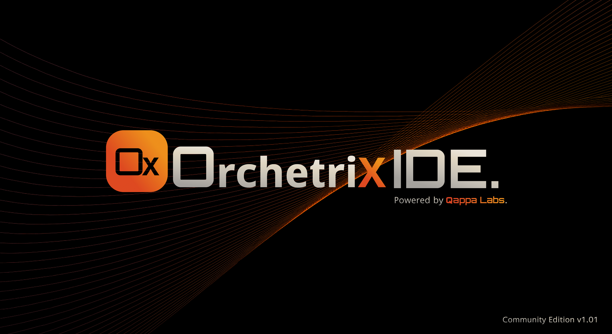

##
# Orchetrix (OX)


An intelligent and intuitive Kubernetes cluster management IDE built for developers, SREs, and DevOps teams.



##  Table of content

- [About](#about)
- [Features](#features)
- [Screenshots](#screenshots)
- [Tech Stack](#tech-stack)
- [Installation](#installation)
- [Run Locally](#run-locally)
- [Usage](#usage)
- [Environment Variables](#environment-variables)
- [Release Notes](#release-notes)
- [Roadmap](#roadmap)
- [Contributing](#contributing)
- [Feedback and Support](#feedback-and-support)
- [License](#license)
- [Acknowledgements](#acknowledgements)

---

## About

**Orchetrix (OX)** is a powerful and intuitive graphical user interface (GUI) for managing Kubernetes clusters. Designed to simplify container orchestration, Orchetrix provides a centralized and visually rich dashboard to deploy, monitor, and troubleshoot your containerized applications. It serves as a user-friendly alternative to command-line tools like kubectl, offering a more accessible way to interact with your Kubernetes resources. With Orchetrix, you can effortlessly navigate through your namespaces, manage nodes and pods, and visualize the overall architecture of your applications, making Kubernetes management more efficient and approachable for everyone.

---

## Features

- **Multi-cluster Management:** Seamlessly connect and manage multiple Kubernetes clusters from a single interface.
- **Live Monitoring:** View real-time CPU, memory, and pod usage across clusters for quick insights into workload performance.
- **Integrated Logs & Terminal:** Directly access pod logs and open terminals inside containers with just a click—no need to switch to the CLI.
- **In-Place YAML Editing:** Edit resource YAMLs directly from the detail panel without opening separate editors or terminals.
- **SSH into Pods:** Securely connect to pods using an SSH-like terminal interface for advanced troubleshooting and debugging.
- **Dark-Themed UI:** Enjoy a clean, modern, and visually appealing dark UI designed for long DevOps sessions.

---

## Screenshots


---

## Tech Stack

- **Frontend:** PyQt6  
- **Backend:** Python 3  
- **Kubernetes API** for cluster interactions  
- **Docker** (for packaging and distribution)

---

## Installation

To install the **Orchetrix (OX)**, simply download the latest release from our official website:

**[Download Orchetrix (OX)](https://www.orchetrix.com/downloads)**

---

## Documentation

Full usage guides, feature explanations, and setup tutorials for **Orchetrix (OX)** are available at:

**[https://www.orchetrix.com/documentation](https://www.orchetrix.com/documentation)**

###  What You Will Find:
- **Welcome to OX:** Quick start, basics, and installation.  
- **How to:** Step-by-step guides for managing clusters, workloads, logs, and pods.  
- **User Interface Overview:** Layout, navigation, workloads, storage, and access control.  
- **FAQ:** Answers to common questions and troubleshooting.  
- **Contribute to OX:** Join the community and contribute.  
- **Support:** Contact the Orchetrix team or reach the community.  

👉 **[Explore OX Documentation](https://www.orchetrix.com/documentation)**

---

## How to Use

### Windows
1. [Download Orchetrix for Windows](https://github.com/qappalabs/orchetrix/releases/download/v0.0.1-beta/Orchetrix_Windows.zip)  
2. Unzip the file (password: `Orchetrix`).  
3. Double-click `orchetrix.exe` to launch.  

### macOS
1. [Download Orchetrix for macOS](https://github.com/qappalabs/orchetrix/releases/download/v0.0.1-beta/Orchetrix_MacOS.zip)  
2. Unzip and move to Applications.  
3. Open `orchetrix.app`.  

### Linux
1. [Download Orchetrix for Ubuntu22](https://github.com/qappalabs/orchetrix/releases/download/v0.0.1-beta/Orchetrix_ubuntu22.zip)  
2. [Download Orchetrix for Ubuntu24](https://github.com/qappalabs/orchetrix/releases/download/v0.0.1-beta/Orchetrix_ubuntu24.zip)  
3. Extract and install dependencies:  
   ```bash
   unzip orchetrix-linux.zip
   cd orchetrix-linux
   pip install -r requirements.txt
