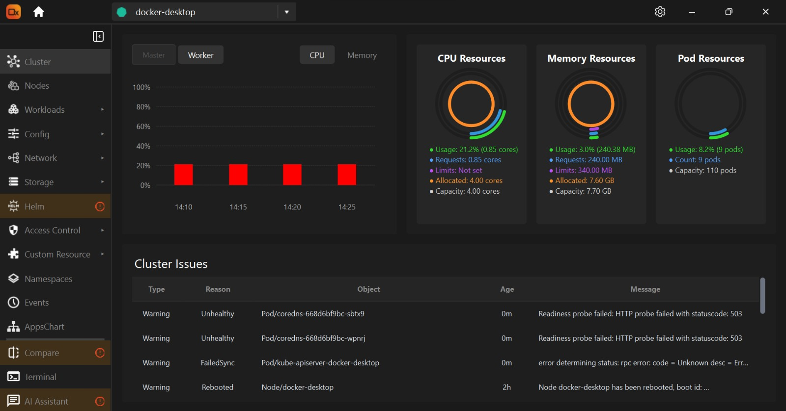

##
# Orchetrix (OX)


An intelligent and intuitive Kubernetes cluster management IDE built for developers, SREs, and DevOps teams.

This major release introduces significant performance optimizations and powerful application visualization capabilities to make Kubernetes operations faster and more intuitive.

---


##  Table of content

- [About](#about)
- [Features](#features)
- [Major Features](#MajorFeatures)
- [Screenshots](#screenshots)
- [Tech Stack](#tech-stack)
- [Installation](#installation)
- [Run Locally](#run-locally)
- [Usage](#usage)
- [Environment Variables](#environment-variables)
- [Release Notes](#release-notes)
- [Roadmap](#roadmap)
- [Contributing](#contributing)
- [Feedback and Support](#feedback-and-support)
- [License](#license)
- [Acknowledgements](#acknowledgements)

---

## About

**Orchetrix (OX)** is a powerful and intuitive graphical user interface (GUI) for managing Kubernetes clusters. Designed to simplify container orchestration, Orchetrix provides a centralized and visually rich dashboard to deploy, monitor, and troubleshoot your containerized applications. It serves as a user-friendly alternative to command-line tools like kubectl, offering a more accessible way to interact with your Kubernetes resources. With Orchetrix, you can effortlessly navigate through your namespaces, manage nodes and pods, and visualize the overall architecture of your applications, making Kubernetes management more efficient and approachable for everyone.

---

## Features

- **Multi-cluster Management:** Seamlessly connect and manage multiple Kubernetes clusters from a single interface.
- **Live Monitoring:** View real-time CPU, memory, and pod usage across clusters for quick insights into workload performance.
- **Integrated Logs & Terminal:** Directly access pod logs and open terminals inside containers with just a click—no need to switch to the CLI.
- **In-Place YAML Editing:** Edit resource YAMLs directly from the detail panel without opening separate editors or terminals.
- **SSH into Pods:** Securely connect to pods using an SSH-like terminal interface for advanced troubleshooting and debugging.
- **Dark-Themed UI:** Enjoy a clean, modern, and visually appealing dark UI designed for long DevOps sessions.

---

##  Major Features

###  Performance Revolution
- **60% faster** page loads with new progressive loading system  
- **Background processing** – Heavy operations no longer block the UI  
- **Smart loading indicators** – Beautiful spinners provide clear visual feedback  
- **Optimized memory usage** for large cluster operations  

###  Apps Chart Visualization (NEW!)
- **Application flow diagrams** – Visual representation of Kubernetes application architectures  
- **Resource relationships** – Interactive diagrams showing connections between pods, services, and deployments  
- **Live monitoring** – Real-time updates of application flow diagrams with 5-second refresh intervals  
- **Deployment analysis** – Comprehensive analysis of deployment patterns and health status  
- **Smart layout** – Horizontal layout for optimal visualization  
- **Export capabilities** – Save diagrams as images for documentation and sharing  

---

##  Improvements

###  Node Management
- Simplified interface by removing unnecessary namespace dropdown  
- Enhanced checkbox visibility for better bulk operations  
- Progressive data loading for large node lists  
- Optimized batch processing for better responsiveness  

###  Stability & Error Handling
- Fixed duplicate error displays across all pages  
- Improved cluster switching experience  
- Enhanced error recovery for network interruptions  
- Resolved namespace loading issues during cluster switches  

###  UI/UX Enhancements
- Consistent loading spinners across all pages  
- Improved responsive design for different screen sizes  
- Enhanced visual feedback and progress reporting  
- Optimized resource table rendering for large datasets  

---

##  Core Capabilities
- Supported **40+ Kubernetes Resources**  
- Advanced features for monitoring, visualization, and analysis  

---

## Screenshots





---

## Tech Stack

- **Frontend:** PyQt6  
- **Backend:** Python 3  
- **Kubernetes API** for cluster interactions  
- **Docker** (for packaging and distribution)

---

## Installation

To install the **Orchetrix (OX)**, simply download the latest release from our official website:

**[Download Orchetrix (OX)](https://www.orchetrix.com/downloads)**

---

## Documentation

Full usage guides, feature explanations, and setup tutorials for **Orchetrix (OX)** are available at:

**[https://www.orchetrix.com/documentation](https://www.orchetrix.com/documentation)**

###  What You Will Find:
- **Welcome to OX:** Quick start, basics, and installation.  
- **How to:** Step-by-step guides for managing clusters, workloads, logs, and pods.  
- **User Interface Overview:** Layout, navigation, workloads, storage, and access control.  
- **FAQ:** Answers to common questions and troubleshooting.  
- **Contribute to OX:** Join the community and contribute.  
- **Support:** Contact the Orchetrix team or reach the community.  

**[Explore OX Documentation](https://www.orchetrix.com/documentation)**

---

## How to Use

Follow the instructions below to install and run **Orchetrix (OX)** on your operating system.

### Windows

1. [Download Orchetrix for Windows](https://github.com/qappalabs/orchetrix/releases/download/v0.0.2-beta/Orchetrix_0.0.2_Windows.zip)
2. Unzip the file to any location.

   **Note:** The ZIP file is password protected. Use the password `orchetrix` to extract it.

3. Open the extracted folder.
4. Double-click `orchetrix.exe` to launch the application.

> If Windows shows a security warning, click "More info" → "Run anyway".
---

### macOS

1. [Download Orchetrix for macOS](https://github.com/qappalabs/orchetrix/releases/download/v0.0.2-beta/Orchetrix_0.0.2_MacOS.zip)
2. Unzip the file to your `Applications` or preferred directory.
3. Open `orchetrix.app`.

> If you get a message like *“App can’t be opened because it is from an unidentified developer”*, go to `System Preferences > Security & Privacy > General`, and click **Open Anyway**.
---

### Linux

1. [Download Orchetrix for Linux](https://github.com/qappalabs/orchetrix/releases/download/v0.0.2-beta/orchetrix_0.0.2_amd64.deb)
2. Open a terminal and navigate to the download folder.
3. Run
   ```bash
   sudo dpkg -i orchetrix_0.0.2_amd64.deb
4. Launch Orchetrix from your applications menu.

---   

## Troubleshooting & Dependencies
If you encounter any issues or module-related errors while installing or running **Orchetrix (OX)**, ensure all required dependencies are properly installed.

You can use the provided `requirements.txt` file to install them:

*pip install -r requirements.txt*

## Usage

Once you have installed and launched **Orchetrix (OX)**, follow these steps to start managing your Kubernetes clusters:

1. **Launch the App**  
   Open the Orchetrix desktop application from your installed location.

2. **Select a Cluster**
    - Go to the cluster panel.
    - OX will fetch all associated clusters automatically and display them in the cluster panel.
    - Select the running cluster you want to work with.

3. **Navigate the Dashboard**
    - View high-level resource usage (CPU, memory, pods).
    - Monitor workloads, namespaces, events, and node health.

4. **Explore Resources**
    - Click on **Cluster**, **Nodes**, **Workloads**, **Config**,  **Network**, **Storage**, **Helm**, **Access Control**, **Custom Resources**, **Namespaces** and **Events** to browse K8s resources.
    - Use the search and filter options to quickly find what you need.

5. **View Logs, SSH into pods and Terminal Access**
    - Select a pod → Click **Logs** to view live logs.
    - Use the built-in terminal to execute shell commands inside containers.

6. **Edit YAML Directly**
    - Click on any resource to open its **Detail Panel**.
    - In the panel, you will find four tabs: **Overview**, **Detail**, **YAML**, and **Events**.
    - Go to the **YAML** tab and click **Edit**.
    - Make your changes directly in the YAML editor.
    - Click **Deploy** to apply the updated configuration immediately to your cluster.

--- 

## Feedback and Support

We are here to help. If you have any questions, suggestions, or run into issues:

- Email us at: **management@qappalabs.in**
- Submit issues or feature requests via [GitHub Issues](https://github.com/qappalabs/orchetrix/issues)

We also welcome feedback on features you would like to see in future releases.

## Acknowledgements

We would like to thank the open-source community and the tools that power Orchetrix (OX):

- [Kubernetes](https://kubernetes.io/) – for making container orchestration accessible and powerful
- [PyQt6](https://riverbankcomputing.com/software/pyqt/intro) – for enabling a native desktop interface
- [Docker](https://www.docker.com/) – for simplifying containerization
- All early contributors and beta testers who helped shape this project
